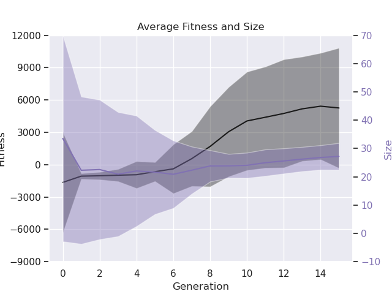

# Global-MultiObjective-Optimization-Project
This repository contains the results obtained during the development of the final project for the Global and MultiObjective Optimization course of University of Trieste. The project consists of the implementation of a driver controller for a car in a simple 2D racing game. Tree-based genetic programming and Reinforcement Learning have been used to evolve the controller. 

## Requirements
The project has been run using `Python 3.10.13` but is expected to run with any version of Python 3. The following packages are required to run the project:

- `DEAP` library, which can be installed using `pip install deap`: this is the main package used to build and learn trees for GP, and a comprehensive documentation is available [here](https://deap.readthedocs.io/en/);
- `pygraphviz` package, which can be installed using `pip install pygraphviz`, used to save readable trees in pdf files;
- `numpy` to correctly pass the states space and save/load it to/from file;
- `matplotlib` to plot the animations;
- `pandas` to handle the data;
- (optional) `PyGame`, which can be installed using `pip install pygame`, if you want to play the game with a Graphical User Interface;
- `operator`, `time` and `random` from the standard library.
  
## How to run
Clone the repository and move inside it:
```shell
git clone git@github.com:DavideRossi1/Global-MultiObjective-Optimization-Project.git
cd Global-MultiObjective-Optimization-Project
```
The repository contains two main modules:

- [the GUI game](GUIGame/), a single file which can be run using
  
    ```shell
    python GUIGame/main.py 
    ```
    
    The game will continue running: a new game is started 3 seconds after the previous game is over. To stop the application, just close the window.

- [the main game](source_files/), which contains all the files needed to learn and run an agent to play the game. Before running the game, have a look at the [Constants file](source_files/Constants.py) and set them as you prefer. Then, run the game with
    ```shell
        python source_files/main.py
    ```
    If no agent has been imported a new agent will be learnt using the parameters set, and some information will be printed to monitor the learning phase.
    After the learning phase has ended, the game will start (printed in the terminal, plotted or both, according to the parameters set).

    Some learned agents are already available in the [agents folder](agents/) (not all the possible combinations, hence check if the agent you want to use is available, or learn it from scratch).

#### Further note
if you are on Linux OS and using a computer with a Rayzen CPU and an integrated AMD Radeon Graphics GPU, you may encounter a warning message like this when trying to plot the animation:
```shell
MESA-LOADER: failed to open radeonsi: /usr/lib/dri/radeonsi_dri.so: cannot open shared object file: No such file or directory (search paths /usr/lib/x86_64-linux-gnu/dri:\$${ORIGIN}/dri:/usr/lib/dri, suffix _dri)
failed to load driver: radeonsi
MESA-LOADER: failed to open swrast: /usr/lib/dri/swrast_dri.so: cannot open shared object file: No such file or directory (search paths /usr/lib/x86_64-linux-gnu/dri:\$${ORIGIN}/dri:/usr/lib/dri, suffix _dri)
failed to load driver: swrast
```
This probably happens since Matplotlib is trying to use the GPU to plot the animation but fails to load the correct drivers.
In order to fix it, it is enough to set the following environment variable:
```shell
export LD_PRELOAD=/usr/lib/x86_64-linux-gnu/libstdc++.so.6
```

## Implementation
The agent have been tested with many different parameters and configurations. In particular, four main parameters can be set in the [Constants file](source_files/Constants.py), and setting the will also automatically set the paths for the agents and the scores files. The parameters are the following:
- `USEGA`: if set to `True`, the game will use a tree-based genetic programming algorithm to learn the agent and/or to play it (depending if you chose to import an already learnt agent or to learn it from scratch), otherwise it will use a Reinforcement Learning algorithm (more specifically, a Temporal Difference algorithm, with SARSA, Q-Learning or Expected SARSA approach according to the parameters set);
- `CONTINUOUSENV`: if set to `True`, the game will use a continuous state space, meaning that there will be no walls and the cars will be able to cross the boundary and reappear on the opposite side of the screen;
- `BOOST`: if set to a value greater than 1, the player car will have a boost ability, which will allow to move faster in order to dodge the enemy;
- `COUNTER`: each time the score reaches this value, the enemy cars will be faster, hence the game will be harder, and the counter will be reset: in this way you can simulate an increasing difficulty.


## Results

Some results obtained during the development of the project are available in the [scores](scores/) folder, subdivided acoording to the previous parameters. The corresponding learned agents are in the [agents](agents/) folder, which has the same structure. We can have a look at some of them:

### Genetic Algorithm



This is the average fitness obtained by a tree based Genetic Algorithm agent, with 200 as starting population, 15 generations and 7 as tournament size, and no boost nor increasing difficulty. We can see that the rewards are increasing, while the trees size converges towards about 35.


In this case instead we have an increasing difficulty. As we can see the fitness is still increasing, but it is lower than the previous case, since the agent has much more difficulty in dodging the enemies when their speed increases.

### Reinforcement Learning


This is the mean score obtained by an Expected SARSA RL agent, with no boost and no increasing difficulty. We can clearly see that the agent is able to learn how to play the game after a few generations.


In this case we also have an Expected SARSA RL agent, but we enabled the increasing difficulty. The agent is still able to learn how to play the game, but it is not able to reach the perfect score since after some time the difficulty becomes too high for the agent to handle.

Finally, we can have a look at some animations of the agents playing the game:


## Other notes
The folder [routines](routines/) contains some scripts used to automatize the learning process and to plot the results: 
- the two bash scripts allow to run all the tests for both agents, both environments, with 2 different boosts and 2 different counters, and to save the results in the corresponding folders (some default parameters have been used to run the tests), and can be run with `bash runEA.sh` and `bash runRL.sh` respectively;
- the file [plots.ipynb](routines/plots.ipynb) allows to update the plots of the results, and to save them in the corresponding folders.